# Banking On It

## Getting Started

_Banking On It_ is built with the _Java_ programming language.

The application that is most optimized to run the program is [_Ready to Program with Java_](https://ready-to-program-with-java.software.informer.com/1.7/). This application can be downloaded on the _Microsoft Windows_ operating system. However, the program can also be run with modern IDE’s such as [_IntelliJ_](https://www.jetbrains.com/idea/).  

To run the program, ensure that you download all of the files within the _src_ directory. _Main.java_ is the entry point into _Banking On It_.

## Using the Program

_Banking On It_ is designed for both customers and administrators. If you would like the view the customer interface, please navigate to the [Customers](#customers) section of the documentation. If you would like to view the administrator interface, please navigate to the [Administrators](#administrators) section of the documentation. [General Information](#general-information) that is relevant when using the program is available towards the end of the documentation.

### Customers

After initially running the program, you will be met with the _Home Page_ screen:

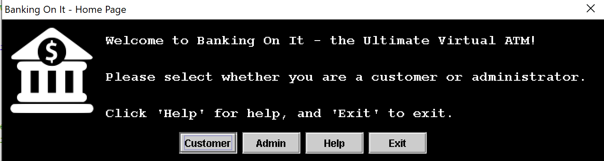

At this point, please click on the _Customer_ button.

After clicking on the _Customer_ button, you will be directed to the _Customer Hub_:

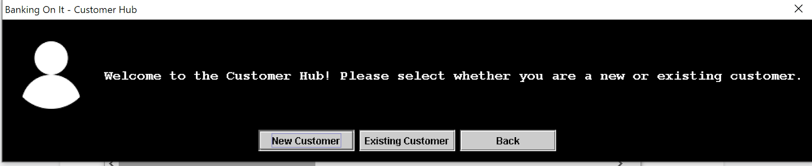

If you are a new customer, select [_New Customer_](#new-customer). If you already have an account, select [_Existing Customer_](#existing-customer). Click _Back_ if you would like to return to the _Home Page_.

#### New Customer

By clicking the _New Customer_ button, you will initiate continuous prompts asking you to input your personal information. Firstly, you will be asked to enter your name:

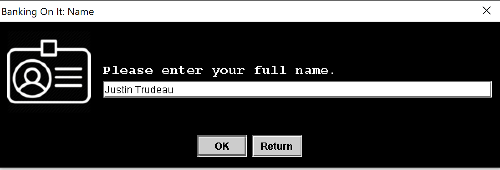

If you input characters that are not letters of the alphabet, you will receive an _Error Message_, instructing you to only enter letters. After inputting your name, you will be asked to enter your phone number:

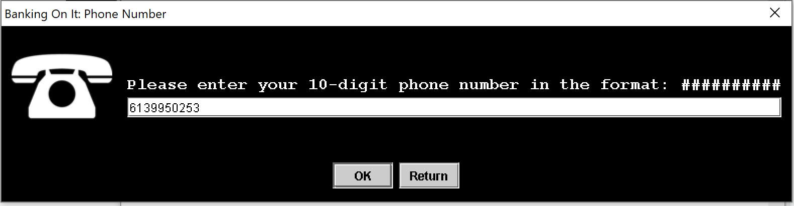

Please note that you must use the format: ##########, where there are no spaces, hyphens, or brackets between the digits. If you input any characters that are not numbers, you will receive an _Error Message_, instructing you to only enter numbers. If you input a phone number that is not ten digits long, you will receive an _Error Message_, instructing you to ensure that the phone number entered is ten digits long. After inputting your phone number, you will be asked to enter your address:

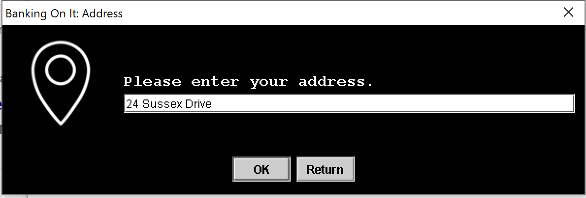

If your address contains characters that are not alphanumeric, you will receive an _Error Message_, instructing you to only enter alphanumeric characters. After entering your address, you will be asked to create an alphanumeric account key:

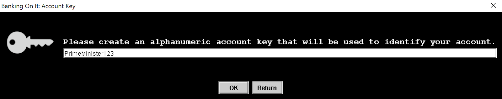

Please note that this key will be case-sensitive. If your account key contains characters that are not alphanumeric, you will receive an _Error Message_, instructing you to only enter alphanumeric characters. After creating your account key, you will be asked to enter the amount that you would like to deposit in your account:

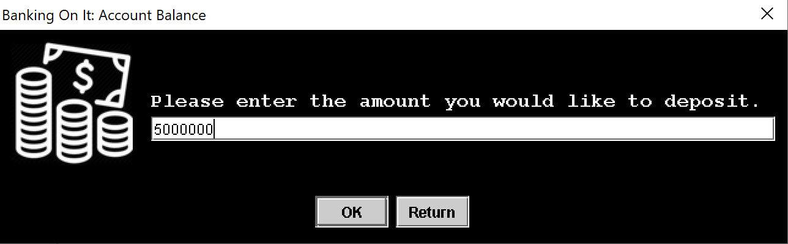

If you input any characters that are not numbers, you will receive an _Error Message_, instructing you to only enter numbers. If you deposit an amount that is less than zero, you will receive an _Error Message_, instructing you to deposit an amount greater than or equal to zero.

At this point, the program will parse through its database to determine whether your account already exists. If an account with the same name and account key as your’s exists, you will receive an _Error Message_, informing you that the account already exists, and asking you to either create a new key or log-in (if you are the owner of the account that already exists). After receiving this message, you will be redirected to the _Customer Hub_.

If your account is new to the database, you will receive the following message:

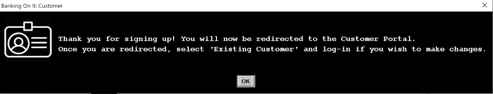

As the message states, at this point, you will be redirected back to the _Customer Hub_.

#### Existing Customer

After clicking the _Existing Customer_ button, you will be prompted to log-in. Firstly, you will be asked to enter your name:

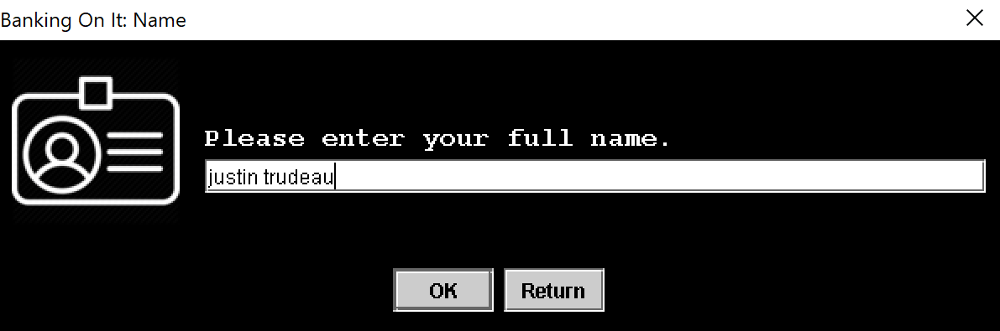

Note that the name is not case-sensitive, meaning you can enter your name uncapitalized and the name will still match with your account. If you input characters that are not letters of the alphabet, you will receive an _Error Message_, instructing you to only enter letters. After inputting your name, you will be asked to enter your account key:

Note that the account key is case-sensitive.

If the information you entered does not match the information of any existing users, you will receive an _Error Message_ indicating that the user entered does not exist. The program will then redirect you to the _Customer Hub_.

If the user information entered matches an existing user, you will be directed to the _Action Portal_:

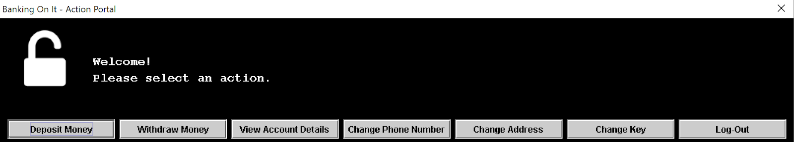

Once you have reached the portal, you can select an action to modify your account details. The purpose of each button is outlined below:

_Deposit Money_: Here, you can deposit money to your account. If you input any characters that are not numbers, you will receive an _Error Message_, instructing you to only enter numbers. If you deposit an amount that is less than zero, you will receive an _Error Message_, instructing you to deposit an amount greater than or equal to zero.

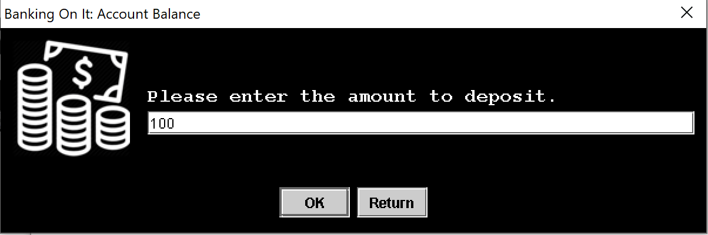

_Withdraw Money_: Here, you can withdraw money from your account. If you input any characters that are not numbers, you will receive an _Error Message_, instructing you to only enter numbers. If you withdraw an amount that is less than zero, you will receive an _Error Message_, instructing you to withdraw an amount greater than or equal to zero. If you withdraw an amount that exceeds your account balance, you will receive an _Error Message_, instructing you to withdraw an amount that is less than or equal to your bank balance.

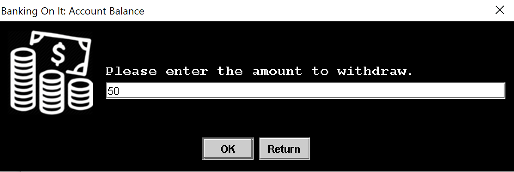

When you successfully deposit or withdraw a certain amount, you will receive the following message: 

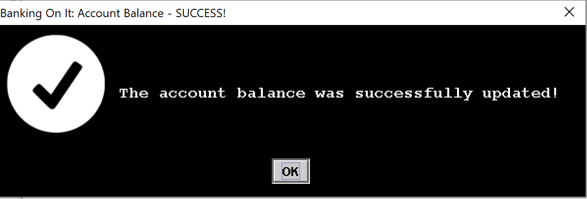

You will then be redirected back to the _Action Portal_.

_View Account Details_: Here, you will be able to view your account details.

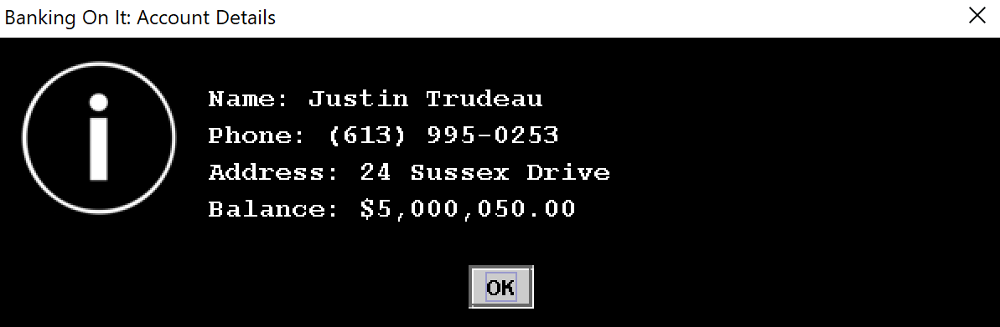

_Change Phone Number_: Here, you will be able to change your phone number. Please note that you must use the format: ##########, where there are no spaces, hyphens, or brackets between the digits. If you input any characters that are not numbers, you will receive an _Error Message_, instructing you to only enter numbers. If you input a phone number that is not ten digits long, you will receive an _Error Message_, instructing you to ensure that the phone number entered is ten digits long.

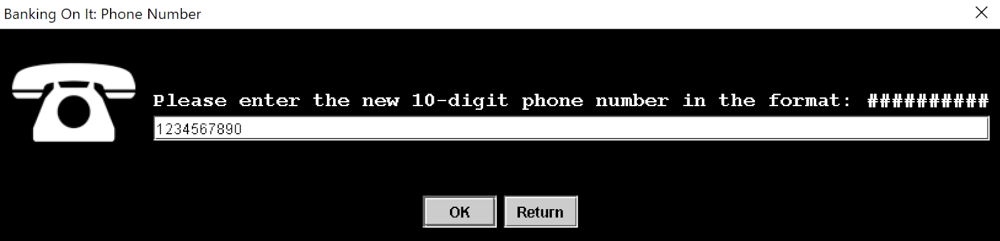

_Change Address_: Here, you will be able to change your address. If your address contains characters that are not alphanumeric, you will receive an _Error Message_, instructing you to only enter alphanumeric characters.

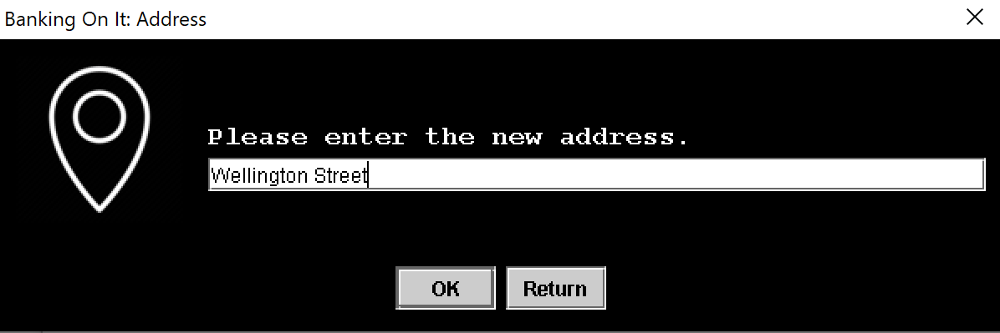

_Change Account Key_: Here, you will be able to change your account key. Please note that this key will be case-sensitive. If your account key contains characters that are not alphanumeric, you will receive an _Error Message_, instructing you to only enter alphanumeric characters.

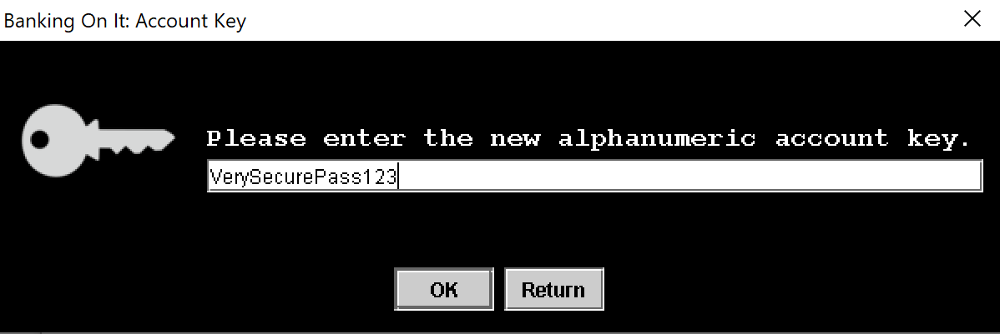

Note that the key entered must vary from your previous key. When you successfully modify your account information, you will receive the following message:

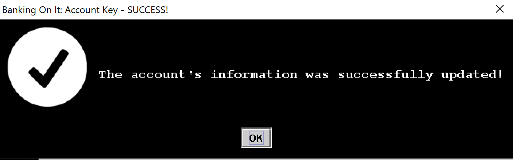

After this message appears, you will be redirected back to the _Action Portal_, where you can make further changes if you wish.

At the _Action Portal_, if you click _Log-Out_, you will be redirected back to the _Customer Hub_.

### Administrators

After initially running the program, you will be met with the _Home Page_ screen:

At this point, please click on the _Admin_ button.

After clicking on the _Admin_ button, you will be asked to undergo the _Admin Log-In_ process. In order to verify that you are an administrator, you will be asked to enter the admin password:

Please note that the password is case-sensitive. If the password is incorrect, you will receive a message informing you that the password is incorrect. You will not be granted access to the _Admin Portal_ until you enter the correct password.

The correct password is: Test123 (outlined here for testing purposes).

Once you successfully log-in, you will be directed to the _Admin Portal_:

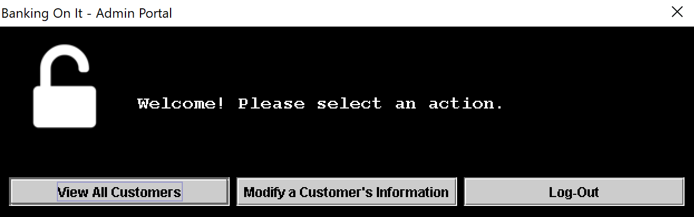

Once you have reached the portal, you can select an action to view or modify customer information. The purpose of each button is outlined below:

_View All Customers_: Here, you will be able to view all the customers stored in the database. For each customer, you will be able to view their name, phone number, address, account key, and account balance. Please note that you cannot edit any customer’s information through this interface.

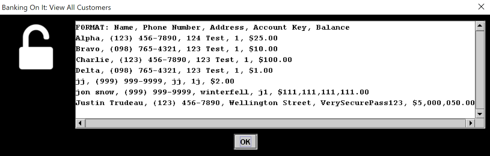

After viewing the customers, you will be redirected back to the _Admin Portal_.

_Modify a Customer’s Information_: Here, you will be able to modify any customer’s information. To gain access, you will first have to enter their full-name and account key. This information can be obtained by using the _View All Customers_ functionality, which is outlined above. After you have gained access to their account, you will be able to make a deposit, withdraw money, view their account details, change their phone number, change their address, and change their account key. The process of gaining access to a customer’s account and editing their information mirrors the protocol in place for _Existing Customers_. To learn more about input restrictions, potential errors, and what to expect when accessing a customer’s account and editing their information, please head to the part of the documentation reserved for [_Existing Customers_](#existing-customer).

### General Information

-   At any point in the program, clicking the red “X” button on the top right corner of the dialog box will send you back to the previous portal/hub. For example, if you are logged in as an _Existing Customer_, clicking “X” will send you back to the _Customer Hub_.  
-   If you are on the home page, clicking “X” will close the program.  
-   All Return/Back/Log-Out buttons have the same functionality as the “X” buttons.
- Clicking the _Help_ button on the _Home Page_ will initiate a message informing you to refer to this document:
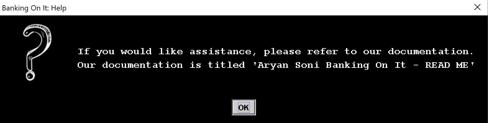
- Please do not edit, modify, or delete anything from _CustomerData.txt_. This text file is the database for the program, and modifying it may disrupt the program's functionality.

***
Thank you for reading the Banking On It documentation! I hope you found it useful! For further inquiries, feel free to [**contact me**](mailto:mail.aryansoni@gmail.com).